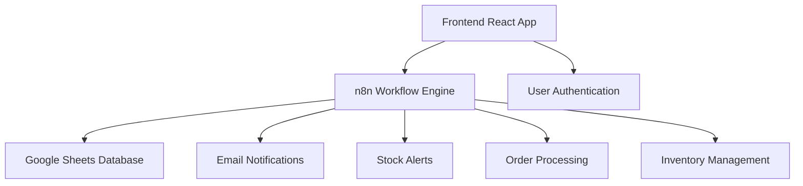

# ☕ Coffee Shop POS - Complete Setup Documentation

## 📋 Table of Contents

1. [System Overview](#system-overview)
2. [Prerequisites](#prerequisites)
3. [Step-by-Step Setup Guide](#step-by-step-setup-guide)
4. [Google Sheets Template Setup](#google-sheets-template-setup)
5. [n8n Workflow Configuration](#n8n-workflow-configuration)
6. [Frontend Deployment](#frontend-deployment)
7. [Testing & Validation](#testing--validation)
8. [Client Handover](#client-handover)
9. [Troubleshooting](#troubleshooting)
10. [Maintenance & Updates](#maintenance--updates)

---

## 🏗️ System Overview

The Coffee Shop POS system consists of three main components:



### **Architecture Components:**

- **Frontend**: React-based POS interface with real-time updates
- **Backend**: n8n workflow engine handling all business logic
- **Database**: Google Sheets for data storage and management
- **Automation**: Email alerts, stock monitoring, analytics
- **Deployment**: Railway for hosting, Google Apps Script for templates

---

## ✅ Prerequisites

### **Required Accounts & Services:**

1. **Google Account** (for Sheets & Apps Script)
2. **n8n Instance** (cloud or self-hosted)
3. **Railway Account** (for frontend hosting)
4. **Gmail Account** (for notifications)
5. **Domain** (optional, for custom URLs)

### **Technical Requirements:**

- Node.js 16+ 
- Git
- Code editor (VS Code recommended)
- Modern web browser
- Basic understanding of:
  - JavaScript/React
  - n8n workflows
  - Google Sheets
  - Environment variables

### **Access Permissions:**

- Google Sheets API access
- Gmail sending permissions
- n8n webhook creation
- Railway deployment rights

---

## 🚀 Step-by-Step Setup Guide

### **Phase 1: Initial Setup (15 minutes)**

1. **Clone the Repository**
```bash
git clone https://github.com/your-repo/coffee-shop-pos
cd coffee-shop-pos
npm install
```

2. **Create Environment File**
```bash
cp .env.example .env
```

3. **Initial Configuration Check**
```bash
npm run setup
```

### **Phase 2: Google Sheets Template (10 minutes)**

### **Phase 3: n8n Workflow Setup (20 minutes)**

### **Phase 4: Frontend Deployment (15 minutes)**

### **Phase 5: Testing & Validation (10 minutes)**

**Total Setup Time: ~70 minutes**

---

## 📊 Google Sheets Template Setup

### **Step 1: Create New Google Sheets**

1. Go to [Google Sheets](https://sheets.google.com)
2. Click **"+ Blank"** to create new spreadsheet
3. Rename to: `[Client Name] Coffee Shop POS`
4. Note the URL - extract the spreadsheet ID:
   ```
   https://docs.google.com/spreadsheets/d/1ABC123DEF456GHI789/edit
                                      ^^^^^^^^^^^^^^^^^ 
                                      This is your Spreadsheet ID
   ```

### **Step 2: Install Apps Script Template**

1. In your Google Sheets, go to **Extensions > Apps Script**
2. Delete the default `Code.gs` content
3. Copy the entire `app-script.js` content from the repository
4. Paste into the Apps Script editor
5. Save the project (Ctrl+S)
6. Name it: `Coffee POS Template Generator`

### **Step 3: Initialize Template**

1. In Apps Script, click **Run** button next to `initializeCoffeePOSTemplate`
2. **Grant Permissions** when prompted:
   - Click **Review permissions**
   - Choose your Google account
   - Click **Advanced > Go to Coffee POS Template (unsafe)**
   - Click **Allow**
3. Wait for execution to complete (30-60 seconds)
4. Check Google Sheets - you should see multiple new sheets created

### **Step 4: Verify Template Creation**

✅ **Expected Sheets Created:**
- 📖 Setup Instructions
- 🔧 n8n Configuration  
- Settings
- Products
- Ingredients
- Recipes
- Suppliers
- Orders
- Ingredient_Usage_Log
- Cost_Analysis
- Purchase_Orders
- Purchase_Order_Items

### **Step 5: Get Configuration Info**

1. In Google Sheets, go to **☕ Coffee POS Setup > 🔧 Generate n8n Config**
2. Copy the **Spreadsheet ID** from the n8n Configuration sheet
3. Note down the webhook URLs structure
4. Save these details for n8n setup

### **🎯 Key Information to Copy:**
```
Spreadsheet ID: 1ABC123DEF456GHI789
Spreadsheet URL: https://docs.google.com/spreadsheets/d/1ABC123DEF456GHI789/edit
```

---

## ⚙️ n8n Workflow Configuration

### **Step 1: Prepare n8n Instance**

#### **Option A: n8n Cloud (Recommended)**
1. Go to [n8n.cloud](https://n8n.cloud)
2. Sign up for an account
3. Create new workflow
4. Note your n8n instance URL: `https://your-instance.app.n8n.cloud`

#### **Option B: Self-hosted n8n**
```bash
npm install n8n -g
n8n start
# Access at http://localhost:5678
```

### **Step 2: Import Coffee Shop POS Workflow**

1. In n8n interface, click **"+"** to create new workflow
2. Click **"..."** menu > **Import from File**
3. Upload the `Coffee_Shop_POS.json` file from repository
4. Click **Save** and name it: `Coffee Shop POS - [Client Name]`

### **Step 3: Configure Google Sheets Integration**

#### **3.1: Setup Google Sheets Credentials**
1. In n8n, go to **Credentials** tab
2. Click **"+ Add Credential"**
3. Search for **"Google Sheets OAuth2 API"**
4. Fill in the required fields:
   ```
   Name: Coffee POS Google Sheets
   Client ID: [Your Google OAuth Client ID]
   Client Secret: [Your Google OAuth Client Secret]
   ```
5. Click **Connect my account** and authorize

#### **3.2: Update Spreadsheet ID in All Nodes**
1. Open each **Google Sheets** node in the workflow
2. Update the **Document ID** field with your Spreadsheet ID
3. **Critical Nodes to Update:**
   - Get Settings
   - Get Products  
   - Get Ingredients
   - Save Order to Sheets
   - Get Current Stock
   - Update Product Stock
   - Get All Products
   - Get Orders Data
   - Get Orders for Analytics

### **Step 4: Configure Email Notifications**

1. Find the **"Send Low Stock Email"** node
2. Update email settings:
   ```
   From: noreply@yourcoffeeshop.com
   To: manager@yourcoffeeshop.com
   ```
3. Configure SMTP settings in n8n credentials

### **Step 5: Get Webhook URLs**

1. **Activate** the workflow (toggle switch)
2. Copy webhook URLs from each webhook node:

```bash
# Data Load Webhook
https://your-instance.app.n8n.cloud/webhook/dataload

# Process Order Webhook  
https://your-instance.app.n8n.cloud/webhook/ordersubmit

# Update Inventory Webhook
https://your-instance.app.n8n.cloud/webhook/update-inventory

# Low Stock Webhook
https://your-instance.app.n8n.cloud/webhook/low-stock

# Analytics Webhook
https://your-instance.app.n8n.cloud/webhook/analytics

# Dashboard Stats Webhook
https://your-instance.app.n8n.cloud/webhook/dashboard-stats
```

### **Step 6: Test n8n Workflow**

1. Click **Test workflow** in n8n
2. Trigger the **Data Load** webhook manually
3. Verify data flows from Google Sheets
4. Check for any errors in execution log

---

## 🌐 Frontend Deployment

### **Step 1: Configure Environment Variables**

1. Open the `.env` file in your project
2. Update with your actual values:

```bash
# Server Configuration
NODE_ENV=production
PORT=3000

# Shop Configuration  
SHOP_NAME=Your Coffee Shop Name
CURRENCY=PHP
TAX_RATE=0.12

# Authentication
JWT_SECRET=your-super-secret-jwt-key-min-32-chars

# n8n Webhook URLs - UPDATE WITH YOUR ACTUAL URLs
N8N_DATA_LOAD_WEBHOOK=https://your-instance.app.n8n.cloud/webhook/dataload
N8N_PROCESS_ORDER_WEBHOOK=https://your-instance.app.n8n.cloud/webhook/ordersubmit
N8N_UPDATE_INVENTORY_WEBHOOK=https://your-instance.app.n8n.cloud/webhook/update-inventory
N8N_LOW_STOCK_WEBHOOK=https://your-instance.app.n8n.cloud/webhook/low-stock
N8N_ANALYTICS_WEBHOOK=https://your-instance.app.n8n.cloud/webhook/analytics
N8N_DASHBOARD_WEBHOOK=https://your-instance.app.n8n.cloud/webhook/dashboard-stats

# Google Sheets Configuration
GOOGLE_SHEETS_ID=1ABC123DEF456GHI789

# Email Configuration (for client notifications)
MANAGER_EMAIL=manager@yourcoffeeshop.com
ALERT_EMAIL=alerts@yourcoffeeshop.com
```

### **Step 2: Test Local Development**

```bash
# Install dependencies
npm install

# Start development server
npm run dev

# Test webhook connectivity
npm run test-webhooks
```

**Expected Output:**
```
🧪 Testing n8n Webhook Connectivity...

✅ dataLoad: Connected (200)
✅ processOrder: Connected (200)  
✅ updateInventory: Connected (200)
✅ lowStock: Connected (200)
✅ analytics: Connected (200)
✅ dashboard: Connected (200)

📊 Results: 6/6 webhooks accessible
🎉 All webhooks are working! Your Coffee POS is ready.
```

### **Step 3: Deploy to Railway**

#### **3.1: Setup Railway Account**
1. Go to [Railway.app](https://railway.app)
2. Sign up with GitHub account
3. Connect your repository

#### **3.2: Configure Railway Deployment**
1. Click **"Deploy from GitHub repo"**
2. Select your Coffee Shop POS repository
3. Railway will auto-detect Node.js project
4. Set environment variables in Railway dashboard

#### **3.3: Add Environment Variables in Railway**
1. Go to your Railway project dashboard
2. Click **Variables** tab
3. Add each environment variable from your `.env` file
4. **Do not** add the `.env` file to repository for security

#### **3.4: Deploy Application**
```bash
# Deploy to Railway
npm run deploy

# Or push to connected GitHub repo
git add .
git commit -m "Deploy Coffee Shop POS"
git push origin main
```

#### **3.5: Get Deployment URL**
1. Railway will provide a URL like: `https://your-app.up.railway.app`
2. Test the deployment by visiting the URL
3. Verify login page loads correctly

### **Step 4: Custom Domain (Optional)**

1. In Railway dashboard, go to **Settings > Domains**
2. Click **Add Domain**
3. Enter your custom domain: `pos.yourcoffeeshop.com`
4. Configure DNS records as instructed
5. Wait for SSL certificate generation

---

## 🧪 Testing & Validation

### **Phase 1: Component Testing**

#### **1.1: Test Google Sheets Template**
```bash
# In Google Sheets Apps Script
function testTemplate() {
  validateSheetStructure();
  createSampleOrder();
}
```

**✅ Expected Results:**
- All sheets exist with correct headers
- Sample data is properly formatted
- Test order appears in Orders sheet

#### **1.2: Test n8n Webhooks**
```bash
# Use n8n's test functionality
1. Open each webhook node
2. Click "Listen for calls"  
3. Trigger webhook from browser/Postman
4. Verify data flows correctly
```

#### **1.3: Test Frontend Connectivity**
```bash
npm run test-webhooks
```

### **Phase 2: Integration Testing**

#### **2.1: Complete Order Flow Test**
1. **Login** to POS system with demo credentials:
   ```
   Username: admin
   Password: admin123
   ```

2. **Place Test Order:**
   - Add products to cart
   - Select payment method
   - Complete checkout
   - Verify order appears in Google Sheets

3. **Check Inventory Update:**
   - Verify stock levels decreased
   - Check for low stock alerts if applicable

4. **Test Dashboard:**
   - View today's sales stats
   - Check analytics charts
   - Verify low stock notifications

#### **2.2: Load Testing**
```bash
# Create multiple test orders quickly
# In Google Sheets Apps Script
function createMultipleTestOrders() {
  for(let i = 0; i < 10; i++) {
    createSampleOrder();
    Utilities.sleep(1000); // 1 second delay
  }
}
```

### **Phase 3: User Acceptance Testing**

#### **3.1: Staff Training Checklist**
- [ ] Login/logout functionality
- [ ] Product selection and variants
- [ ] Cart management (add/remove/modify)
- [ ] Payment processing (cash/card/digital)
- [ ] Order completion and receipt
- [ ] Inventory management
- [ ] Dashboard overview
- [ ] Basic troubleshooting

#### **3.2: Performance Validation**
- [ ] Page load time < 3 seconds
- [ ] Order processing < 5 seconds  
- [ ] Dashboard loading < 5 seconds
- [ ] No errors in browser console
- [ ] Mobile responsiveness working
- [ ] Offline fallback functioning

### **Phase 4: Security Testing**

#### **4.1: Authentication Testing**
- [ ] Invalid login attempts blocked
- [ ] Session timeout working
- [ ] JWT tokens properly validated
- [ ] No sensitive data in browser storage

#### **4.2: API Security**
- [ ] Webhook endpoints require authentication
- [ ] No direct access to Google Sheets
- [ ] Error messages don't expose system details
- [ ] Rate limiting functional

---

## 👥 Client Handover

### **Documentation Package**

#### **1. System Access Information**
```
Coffee Shop POS System - [Client Name]

🌐 Application URL: https://your-app.up.railway.app
📊 Google Sheets: [Spreadsheet URL]
⚙️ n8n Workflow: [n8n Instance URL]

🔐 Login Credentials:
Admin: admin / admin123
Staff: staff / staff123  
Manager: manager / manager123

📧 Notifications sent to: manager@yourcoffeeshop.com
🚨 Alerts sent to: alerts@yourcoffeeshop.com
```

#### **2. Quick Start Guide**
```markdown
# Daily Operations

## Opening the Store
1. Go to [Application URL]
2. Login with your credentials
3. Check dashboard for overnight activity
4. Review stock levels and alerts

## Processing Orders  
1. Select products by clicking on them
2. Modify quantities with +/- buttons
3. Choose payment method
4. Click "Complete Order"
5. Print receipt if needed

## Closing Procedures
1. Check today's sales in dashboard
2. Review low stock alerts
3. Plan tomorrow's restocking
4. Logout securely
```

#### **3. Contact Information**
```
Technical Support:
Developer: [Your Name]
Email: [Your Email]
Phone: [Your Phone]
Support Hours: [Your Availability]

Emergency Contact:
For system down situations: [Emergency Contact]

System Status:
Monitor at: [Status Page URL if available]
```

### **Training Materials**

#### **Video Walkthroughs** (Create these)
1. **System Overview** (5 minutes)
2. **Daily Operations** (10 minutes)  
3. **Inventory Management** (8 minutes)
4. **Dashboard & Reports** (7 minutes)
5. **Troubleshooting** (5 minutes)

#### **Printed Materials**
- Quick reference card
- Emergency procedures
- Common error solutions
- Contact information sheet

### **Maintenance Schedule**

#### **Weekly Tasks:**
- [ ] Review sales analytics
- [ ] Check stock levels  
- [ ] Verify system performance
- [ ] Update product pricing if needed

#### **Monthly Tasks:**
- [ ] System backup verification
- [ ] User access review
- [ ] Performance optimization
- [ ] Feature requests evaluation

#### **Quarterly Tasks:**
- [ ] Full system health check
- [ ] Security audit
- [ ] Staff retraining if needed
- [ ] System updates and improvements

---

## 🔧 Troubleshooting

### **Common Issues & Solutions**

#### **Issue 1: "Cannot connect to server"**
**Symptoms:** Login page won't load, network errors
**Solutions:**
1. Check internet connection
2. Verify Railway deployment status
3. Check environment variables
4. Contact hosting provider

#### **Issue 2: "Order processing failed"**
**Symptoms:** Orders don't complete, error messages during checkout
**Solutions:**
1. Check n8n workflow status
2. Verify webhook URLs in .env
3. Test Google Sheets permissions
4. Check order data format

#### **Issue 3: "Products not loading"**
**Symptoms:** Empty product grid, loading spinner stuck
**Solutions:**
1. Test data load webhook manually
2. Check Google Sheets permissions
3. Verify product data format
4. Clear browser cache

#### **Issue 4: "Dashboard shows no data"**
**Symptoms:** Zero stats, empty charts
**Solutions:**
1. Check if orders exist in Google Sheets
2. Test analytics webhook
3. Verify date range calculations
4. Check data processing in n8n

#### **Issue 5: "Stock not updating"**
**Symptoms:** Stock levels don't decrease after orders
**Solutions:**
1. Check inventory update webhook
2. Verify product ID matching
3. Test stock calculation logic
4. Check Google Sheets write permissions

### **Debug Mode Activation**

```bash
# Enable debug logging
NODE_ENV=development npm start

# Check webhook responses
npm run test-webhooks

# View detailed logs
npm run logs
```

### **Emergency Procedures**

#### **System Down Scenario:**
1. **Immediate Actions:**
   - Switch to manual order recording
   - Use backup payment methods
   - Document all transactions

2. **Recovery Steps:**
   - Check Railway status
   - Verify n8n workflow
   - Test Google Sheets access
   - Contact technical support

3. **Data Recovery:**
   - Manual entry of offline orders
   - Inventory reconciliation
   - Financial verification

### **Performance Optimization**

#### **If System is Slow:**
1. **Check Metrics:**
   - Railway resource usage
   - n8n execution times
   - Google Sheets API quotas

2. **Optimization Steps:**
   - Clear browser cache
   - Optimize webhook responses
   - Reduce Google Sheets complexity
   - Enable caching if available

#### **Database Maintenance:**
```javascript
// Monthly Google Sheets cleanup
function monthlyCleanup() {
  // Archive old orders
  // Remove test data
  // Optimize sheet structure
  // Update formulas if needed
}
```

---

## 🔄 Maintenance & Updates

### **System Monitoring**

#### **Daily Checks:**
- System uptime status
- Error logs review
- Performance metrics
- User activity monitoring

#### **Weekly Reviews:**
- Sales data accuracy
- Inventory reconciliation  
- System performance trends
- User feedback collection

#### **Monthly Audits:**
- Security assessment
- Data backup verification
- Feature usage analysis
- Cost optimization review

### **Update Procedures**

#### **Code Updates:**
```bash
# 1. Test in development
git checkout develop
npm run test

# 2. Deploy to staging
git checkout staging  
npm run deploy:staging

# 3. Production deployment
git checkout main
npm run deploy:production
```

#### **Google Sheets Updates:**
1. Always backup before changes
2. Test in duplicate sheet first
3. Update n8n workflow if needed
4. Verify data integrity after changes

#### **n8n Workflow Updates:**
1. Export current workflow as backup
2. Test changes in duplicate workflow
3. Update webhook URLs if changed
4. Monitor execution after deployment

### **Backup Strategy**

#### **Automated Backups:**
- **Google Sheets:** Auto-saved by Google
- **n8n Workflows:** Export weekly
- **Code Repository:** Git version control
- **Environment Config:** Secure documentation

#### **Recovery Testing:**
- Monthly backup restoration test
- Disaster recovery simulation
- Data integrity verification
- System rebuild procedures

### **Scaling Considerations**

#### **When to Scale:**
- Order volume > 1000/day
- Response time > 5 seconds
- Storage approaching limits
- Multiple location needs

#### **Scaling Options:**
- Upgrade Railway plan
- Optimize Google Sheets structure
- Implement database caching
- Add load balancing

---

## 📞 Support & Resources

### **Technical Support**

**Level 1 - Self Service:**
- Documentation review
- Common issues checklist
- Video tutorials
- FAQ section

**Level 2 - Developer Support:**
- Email support with 24h response
- Remote debugging sessions
- Code review and optimization
- Feature enhancement discussions

**Level 3 - Emergency Support:**
- Phone support for critical issues
- Immediate system restoration
- Data recovery assistance
- Business continuity support

### **Additional Resources**

#### **Documentation Links:**
- [n8n Documentation](https://docs.n8n.io/)
- [Google Sheets API](https://developers.google.com/sheets/api)
- [Railway Deployment Guide](https://docs.railway.app/)
- [React Documentation](https://reactjs.org/docs/)

#### **Community Support:**
- GitHub Issues for bug reports
- Discord community for discussions
- Monthly user meetups
- Feature request voting

#### **Training Resources:**
- Video tutorial library
- Written step-by-step guides
- Interactive demos
- Best practices documentation

---

## ✅ Setup Completion Checklist

### **Pre-Launch Checklist:**

**Google Sheets Setup:**
- [ ] Template created successfully
- [ ] Sample data populated
- [ ] Spreadsheet ID documented
- [ ] Permissions configured
- [ ] Structure validated

**n8n Workflow Setup:**
- [ ] Workflow imported
- [ ] Google Sheets credentials configured
- [ ] Spreadsheet ID updated in all nodes
- [ ] Email settings configured
- [ ] Webhooks tested and active
- [ ] Error handling verified

**Frontend Deployment:**
- [ ] Environment variables configured
- [ ] Webhook URLs updated
- [ ] Local testing completed
- [ ] Railway deployment successful
- [ ] Custom domain configured (if applicable)
- [ ] SSL certificate active

**Testing & Validation:**
- [ ] Login functionality working
- [ ] Order processing tested
- [ ] Inventory updates verified
- [ ] Dashboard loading correctly
- [ ] Email notifications working
- [ ] Mobile responsiveness confirmed
- [ ] Performance benchmarks met

**Client Handover:**
- [ ] Access credentials provided
- [ ] Training completed
- [ ] Documentation delivered
- [ ] Support contacts shared
- [ ] Maintenance schedule agreed
- [ ] Backup procedures explained

### **Go-Live Approval:**

**System Owner:** _________________ Date: _________

**Technical Lead:** _________________ Date: _________

**Client Representative:** _________________ Date: _________

---

## 🎉 Congratulations!

Your Coffee Shop POS system is now fully operational! 

The system provides:
- ✅ Real-time order processing
- ✅ Automatic inventory management  
- ✅ Comprehensive analytics dashboard
- ✅ Low stock alerts and notifications
- ✅ Mobile-responsive interface
- ✅ Secure authentication
- ✅ Cloud-based reliability

For ongoing support and feature requests, please contact the development team using the information provided in the client handover documentation.

**Enjoy serving great coffee with your new POS system! ☕️**